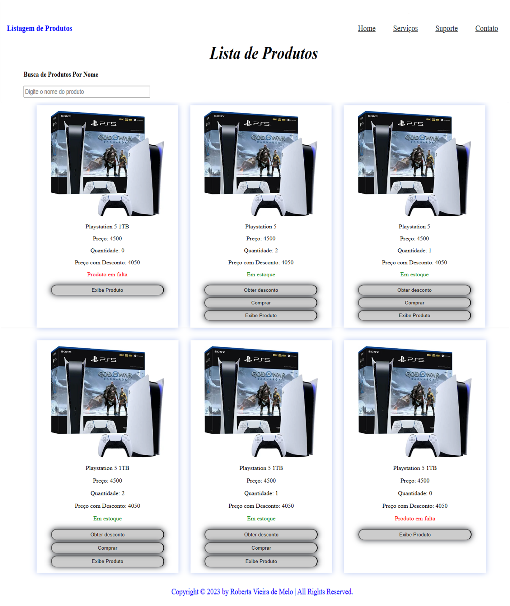

 <h1 align="center">MJV School Angular - semana 04
 </h1>

## 📝Descrição

As directives (diretivas) em Angular são uma classe js, declarada como @directive. Temos 3 diretivas em Angular:

### Component Directives
Eles formam a classe principal, com detalhes de como o componente deve ser processado, instanciado e usado em tempo de execução.

### Structural Directives
Uma diretiva de estrutura lida basicamente com a manipulação dos elementos dom. As diretivas estruturais têm um sinal * antes da diretiva. Por exemplo, ngIf e ngFor .

### Attribute Directives
As diretivas de atributo tratam de alterar a aparência e o comportamento do elemento dom.

