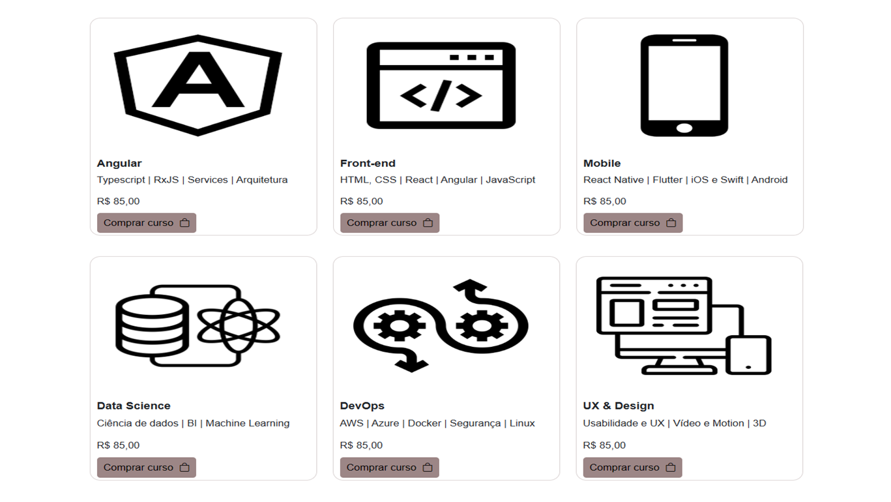
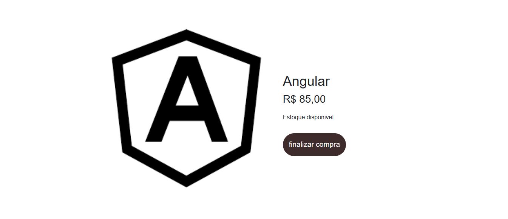
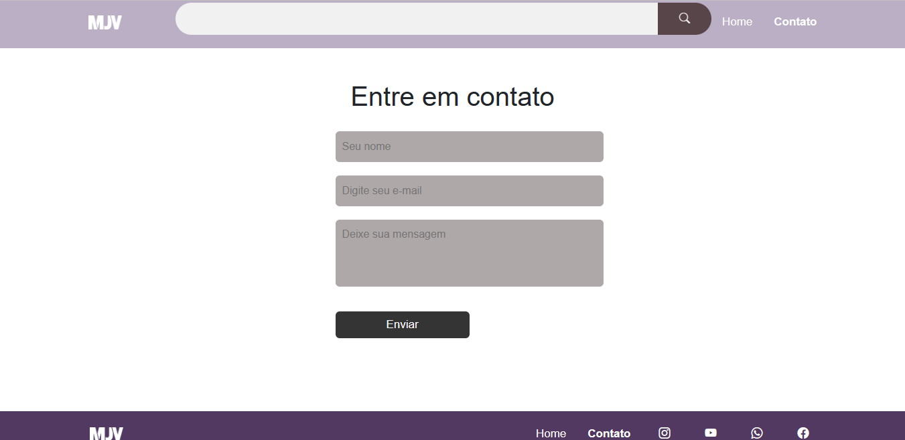

 <h1 align="center"> 🛍️E-commerce
 </h1>


## 📝Descrição
Este é um projeto para site e-commerce de cursos, com objetivo de mostrar as tecnologias mais utilizadas no mercado e, ser uma plataforma fácil de usar intuitiva para o usuário final.

 <h1 align="center"> Home
 </h1>


 <h1 align="center"> Produtos
 </h1>






<h1 align="center"> Contato
 </h1>



## <h2>🔄Entre no diretório para criar projeto</h2>


```bash
  ng new projeto
```

```bash
  cd projeto
```
